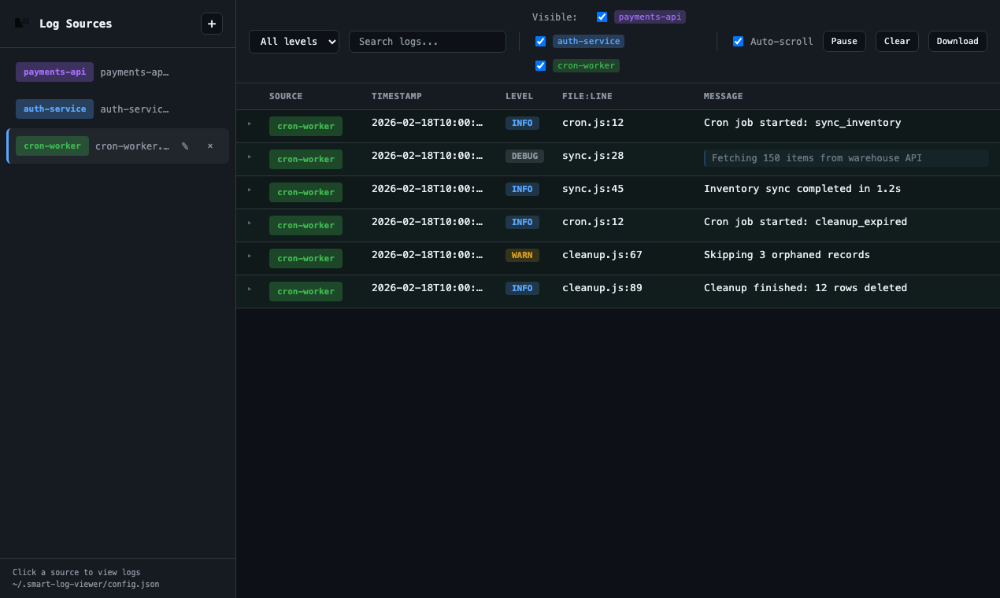

# Smart Log Viewer

[](https://www.npmjs.com/package/smart-log-viewer)
[](https://www.npmjs.com/package/smart-log-viewer)
[](https://nodejs.org)
[](https://github.com/sthnaqvi/smart-log-viewer)

A production-quality real-time structured log viewer for developers. Stream local log files to a browser UI with zero heavy frameworks—just Node.js, Express, WebSocket, and vanilla JavaScript.

<p align="center">
  
</p>

### At a glance (for developers evaluating this tool)

| Metric | Value |
|--------|-------|
| **Runtime** | Node.js ≥18 |
| **Dependencies** | 5 (chalk, commander, express, open, ws) |
| **Bundle size** | No build step; vanilla JS frontend |
| **Config** | `~/.smart-log-viewer/config.json` |
| **Default port** | 3847 |
| **PM2** | Supported via `pm2 install smart-log-viewer` |
| **Tests** | E2E, UI, features, CLI, global install |

## What Problem This Solves

Developers often need to:

- Tail multiple log files simultaneously
- Parse structured JSON logs (e.g. Pino, Winston)
- Filter by level and search text
- Avoid loading huge files into memory
- Keep a persistent list of watched files
- **Identify which service produced each log** when debugging multi-service systems

Smart Log Viewer addresses this with a lightweight, stable tool that uses `tail -F` for streaming and WebSockets for real-time updates.

## Features

- **Source tagging** – Tag each log source with a name and color for instant visual identification
- **File path selector** – Add, remove, edit tags, and focus sources
- **Persistence** – Sources saved to `~/.smart-log-viewer/config.json`
- **Real-time streaming** – WebSocket-based, no polling
- **Visible sources** – Toggle which sources’ logs are shown without stopping tail
- **Structured JSON parsing** – Parses JSON logs safely; malformed lines are ignored
- **Dark theme UI** – Sidebar, topbar filters, log table
- **Level badges** – ERROR, WARN, INFO, DEBUG with colored badges
- **Hover tooltips** – Full value on hover for truncated cells
- **Click to expand** – Click truncated cell for full value modal
- **Filters** – Level dropdown, text search, tag visibility, pause, clear
- **Click row** – Pretty JSON modal
- **Performance** – 2000-row cap, alternating rows, sticky header
- **Bonus** – Auto-scroll toggle, copy log, download visible logs

## Source Tagging

Multi-service debugging demands instant visual source identification. When you tail `payments-api.log`, `auth-service.log`, and `cron-worker.log` together, every log row must show which service produced it—without scanning filenames or guessing.

Each source supports:

- **Tag name** – e.g. `payments-api`, `auth-service`
- **Color** – Distinct color for the tag badge
- **Edit** – Rename tag, change color, or remove without re-adding

Log rows display: `[payments-api] ERROR Timeout connecting to DB`

Senior engineers appreciate this reasoning: clarity over minimalism.

## Installation

### Via npm (recommended)

```bash
npm install -g smart-log-viewer
```

To update: run the same command again. After updating, `smart-log-viewer --version` should show the new version.

### From source

```bash
git clone https://github.com/sthnaqvi/smart-log-viewer.git
cd smart-log-viewer
npm install
```

## Running the CLI

```bash
smart-log-viewer
```

Starts the server on port 3847, loads config from `~/.smart-log-viewer/config.json`, and opens the browser automatically.

## CLI Options

| Option | Description |
|--------|-------------|
| `-p, --port <n>` | Port to listen on (default: 3847) |
| `-c, --config <path>` | Config directory (default: ~/.smart-log-viewer) |
| `--no-open` | Do not open browser automatically |
| `-h, --help` | Show help |
| `-v, --version` | Show version |

## CLI Commands

| Command | Description |
|---------|-------------|
| *(default)* | Start the server and open browser |
| `config` | Show config directory path |
| `info` | Show version, config path, and Node version |

Examples:

```bash
smart-log-viewer --port 9000
smart-log-viewer --config ~/my-config --no-open
smart-log-viewer config
smart-log-viewer info
```

Invalid commands and unknown options are rejected with clear error messages; the server will not start.

## Run (from source)

```bash
npm test    # Run tests first (recommended)
npm start   # Or: node bin/smart-log-viewer.js
```

## Tests

- `npm test` - All test suites (API, UI, features)
- `npm run test:api` - API/WebSocket tests only
- `npm run test:ui` - UI tests (layout, styling, flow)
- `npm run test:features` - Feature & functionality tests

See `docs/FEATURES_AND_TEST_COVERAGE.md` for full feature list and test coverage.

## Development

```bash
npm run dev
```

Uses `--watch` for auto-restart on file changes.

## Persistence

Sources are stored in:

```
~/.smart-log-viewer/config.json
```

Format:

```json
{
  "sources": [
    {
      "path": "/var/log/payments-api.log",
      "tagName": "payments-api",
      "color": "#a371f7"
    },
    {
      "path": "/var/log/auth-service.log",
      "tagName": "auth-service",
      "color": "#58a6ff"
    }
  ]
}
```

- Config is auto-created if missing
- **Backward compatible** – Old configs with `file_paths` are auto-migrated to `sources` with generated tags
- Paths are loaded on server start
- No database; plain JSON only

## Run with PM2

### One-line install (recommended)

Install PM2 globally, then install Smart Log Viewer as a PM2 module:

```bash
npm install -g pm2
pm2 install smart-log-viewer
```

That's it. The UI runs at http://localhost:3847. View logs with `pm2 logs smart-log-viewer`.

### Other PM2 options

Start when already installed globally:

```bash
pm2 start smart-log-viewer --name smart-log-viewer
```

With custom port:

```bash
pm2 start smart-log-viewer -- --port 9000
```

Using ecosystem file (from project root):

```bash
pm2 start ecosystem.config.js
```

## Architecture

```
/bin
  smart-log-viewer.js - CLI entry point

/server
  server.js       - Express, WebSocket, API routes
  tailManager.js  - tail -F, multi-file, broadcast
  configManager.js - read/write sources with tags

/public
  index.html
  app.js
  styles.css
  favicon.svg
  logo.svg
  empty-illustration.svg
```

## Stability

The server handles:

- Invalid file paths
- Deleted files
- File rotation (`tail -F` follows by name)
- Malformed JSON (ignored, no crash)

## Tech Stack

- Node.js
- Express
- ws (WebSocket)
- Vanilla JS frontend
- Modern CSS (no Bootstrap)

---

**Repository:** [github.com/sthnaqvi/smart-log-viewer](https://github.com/sthnaqvi/smart-log-viewer) · **npm:** [smart-log-viewer](https://www.npmjs.com/package/smart-log-viewer) · **Issues:** [Report a bug](https://github.com/sthnaqvi/smart-log-viewer/issues)
