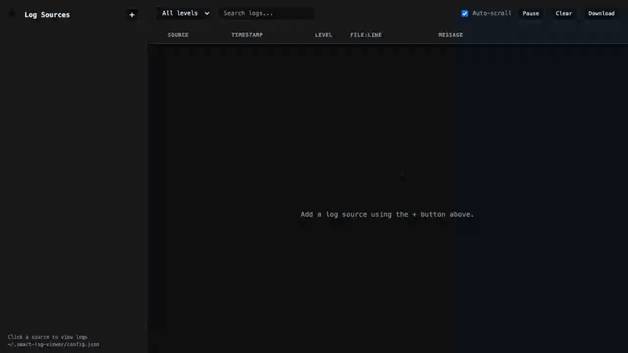

# Smart Log Viewer

**Real-time structured log viewer for Node.js developers** — debug real-time JSON logs streaming locally without tail -f.

[](https://www.npmjs.com/package/smart-log-viewer)
[](https://www.npmjs.com/package/smart-log-viewer)
[](https://nodejs.org)
[](https://github.com/sthnaqvi/smart-log-viewer)

## Quick Start

```bash
npm install -g smart-log-viewer
smart-log-viewer
```

Launches a local log debugging UI at [http://localhost:3847](http://localhost:3847). Add log file paths via the UI; config persists to `~/.smart-log-viewer/config.json`.

### First run

1. Start Smart Log Viewer  
2. Open browser UI automatically  
3. Add log file paths  
4. Start real-time debugging  

No additional setup required.

## Demo



---

Smart Log Viewer is a **structured log viewer** for Node.js developers. It provides **real-time log streaming** of **JSON logs** from local log files—ideal for **local log monitoring** and **debugging microservices** without the overhead of centralized observability stacks.

### At a glance (for developers evaluating this tool)


| Metric           | Value                                        |
| ---------------- | -------------------------------------------- |
| **Runtime**      | Node.js ≥18                                  |
| **Dependencies** | 5 (chalk, commander, express, open, ws)      |
| **Bundle size**  | No build step; vanilla JS frontend           |
| **Config**       | `~/.smart-log-viewer/config.json`            |
| **Default port** | 3847                                         |
| **PM2**          | Supported via `pm2 install smart-log-viewer` |
| **Tests**        | E2E, UI, features, CLI, global install       |


## What Problem This Solves

Developers often need to:

- Tail multiple log files simultaneously
- Parse structured JSON logs (e.g. Pino, Winston)
- Filter by level and search text
- Avoid loading huge files into memory
- Keep a persistent list of watched files
- **Identify which service produced each log** when debugging multi-service systems

Smart Log Viewer addresses this with a lightweight, stable tool that uses `tail -F` for streaming and WebSockets for real-time updates.

## Why This Tool Exists

`tail -f` is fine for raw text, but structured logs (JSON from Pino, Winston, Bunyan) are hard to read in a terminal. When you're debugging multiple services—payments, auth, workers—you end up with several terminal windows, no filtering, and no way to correlate which service produced which log.

ELK, Datadog, and similar tools solve this at scale, but they add setup, cost, and complexity. For local development and quick debugging, you need a lightweight UI that streams JSON logs, lets you filter by level and search text, and visually distinguishes sources—without spinning up Elasticsearch.

Smart Log Viewer fills that gap: a local observability UI that uses `tail -F` and WebSockets, with zero heavy dependencies.

## Key Features

- **Source tagging** – Tag each log source with a name and color for instant visual identification
- **File path selector** – Add, remove, edit tags, and focus sources
- **Persistence** – Sources saved to `~/.smart-log-viewer/config.json`
- **Real-time streaming** – WebSocket-based, no polling
- **Visible sources** – Toggle which sources' logs are shown without stopping tail
- **Structured JSON parsing** – Parses JSON logs safely; malformed lines are ignored
- **Dark theme UI** – Sidebar, topbar filters, log table
- **Level badges** – ERROR, WARN, INFO, DEBUG with colored badges
- **Hover tooltips** – Full value on hover for truncated cells
- **Click to expand** – Click truncated cell for full value modal
- **Filters** – Level dropdown, text search, tag visibility, pause, clear
- **Click row** – Pretty JSON modal
- **Performance** – 2000-row cap, alternating rows, sticky header
- **Bonus** – Auto-scroll toggle, copy log, download visible logs

## Source Tagging

Multi-service debugging demands instant visual source identification. When you tail `payments-api.log`, `auth-service.log`, and `cron-worker.log` together, every log row must show which service produced it—without scanning filenames or guessing.

Each source supports:

- **Tag name** – e.g. `payments-api`, `auth-service`
- **Color** – Distinct color for the tag badge
- **Edit** – Rename tag, change color, or remove without re-adding

Log rows display: `[payments-api] ERROR Timeout connecting to DB`

Senior engineers appreciate this reasoning: clarity over minimalism.

## Use Cases

- **Debugging structured logs** from Node.js services during development
- **Monitoring multiple local microservice logs** in a single view
- **Inspecting JSON logs** generated by Pino, Winston, or Bunyan
- **Replacing terminal tailing** when log files are large or multi-source
- **Quick local observability** without centralized logging infrastructure

## Who This Tool Is For

- Backend engineers debugging services locally
- DevOps / SRE teams doing local log inspection
- Developers working with distributed systems and microservices
- Teams using structured logging (JSON) in Node.js

## Smart Log Viewer vs tail, lnav and ELK


| Tool                                  | UI       | JSON support | Multi-file debugging        | Setup complexity          |
| ------------------------------------- | -------- | ------------ | --------------------------- | ------------------------- |
| `tail`                                | Terminal | ❌           | ❌                          | ✅ None                   |
| `lnav`                                | TUI      | ✅           | ✅                          | ✅ Install binary         |
| ELK (Elasticsearch, Logstash, Kibana) | Web      | ✅           | ✅                          | ❌ High (containers)      |
| **Smart Log Viewer**                  | Web      | ✅           | ✅ (tagged, filtered)        | ✅ `npm install -g`       |

Smart Log Viewer works as a lightweight alternative to terminal log tailing tools and heavy centralized logging platforms for local structured log debugging.

## Works Well With

- **Pino**, **Winston**, **Bunyan** – JSON log format is parsed and displayed with level badges
- **PM2** – Install as module: `pm2 install smart-log-viewer`
- **Node.js services** – Any process writing JSON lines to a file
- **Local development** – No cloud or external services required

## Installation

Smart Log Viewer is a CLI tool installable via npm that launches a local log debugging UI.

```bash
npm install -g smart-log-viewer
```

To update: run the same command again. After updating, `smart-log-viewer --version` should show the new version.

### From source

```bash
git clone https://github.com/sthnaqvi/smart-log-viewer.git
cd smart-log-viewer
npm install
```

## CLI Usage

### Start the server

```bash
smart-log-viewer
```

Starts the server on port 3847, loads config from `~/.smart-log-viewer/config.json`, and opens the browser automatically.

### Options


| Option                | Description                                     |
| --------------------- | ----------------------------------------------- |
| `-p, --port <n>`      | Port to listen on (default: 3847)               |
| `-c, --config <path>` | Config directory (default: ~/.smart-log-viewer) |
| `--no-open`           | Do not open browser automatically               |
| `-h, --help`          | Show help                                       |
| `-v, --version`       | Show version                                    |


### Commands


| Command     | Description                                 |
| ----------- | ------------------------------------------- |
| *(default)* | Start the server and open browser           |
| `config`    | Show config directory path                  |
| `info`      | Show version, config path, and Node version |


Examples:

```bash
smart-log-viewer --port 9000
smart-log-viewer --config ~/my-config --no-open
smart-log-viewer config
smart-log-viewer info
```

Invalid commands and unknown options are rejected with clear error messages; the server will not start.

### Run from source

```bash
npm test    # Run tests first (recommended)
npm start   # Or: node bin/smart-log-viewer.js
```

## PM2 Usage

### One-line install (recommended)

Install PM2 globally, then install Smart Log Viewer as a PM2 module:

```bash
npm install -g pm2
pm2 install smart-log-viewer
```

That's it. The UI runs at [http://localhost:3847](http://localhost:3847). View logs with `pm2 logs smart-log-viewer`.

### Other PM2 options

Start when already installed globally:

```bash
pm2 start smart-log-viewer --name smart-log-viewer
```

With custom port:

```bash
pm2 start smart-log-viewer -- --port 9000
```

Using ecosystem file (from project root):

```bash
pm2 start ecosystem.config.js
```

## Configuration & Persistence

Sources are stored in:

```
~/.smart-log-viewer/config.json
```

Format:

```json
{
  "sources": [
    {
      "path": "/var/log/payments-api.log",
      "tagName": "payments-api",
      "color": "#a371f7"
    },
    {
      "path": "/var/log/auth-service.log",
      "tagName": "auth-service",
      "color": "#58a6ff"
    }
  ]
}
```

- Config is auto-created if missing
- **Backward compatible** – Old configs with `file_paths` are auto-migrated to `sources` with generated tags
- Paths are loaded on server start
- No database; plain JSON only

## Architecture

```
/bin
  smart-log-viewer.js - CLI entry point

/server
  server.js       - Express, WebSocket, API routes
  tailManager.js  - tail -F, multi-file, broadcast
  configManager.js - read/write sources with tags

/public
  index.html
  app.js
  styles.css
  favicon.svg
  logo.svg
  empty-illustration.svg
```

## Performance & Stability

- **Constant memory streaming** – Uses `tail -F`; does not load entire files into memory. In-memory buffer is capped at 2000 rows per client.
- **Large log capability** – Handles large log files without OOM; only recent entries are buffered.
- **File rotation** – `tail -F` follows by filename; rotation (logrotate, etc.) is handled correctly.
- **Invalid paths** – Gracefully handles missing or unreadable files; server does not crash.
- **Deleted files** – Stops tailing when a file is removed.
- **Malformed JSON** – Non-JSON lines are ignored; no crash.

## Testing & Reliability

- `npm test` – All test suites (API, UI, features, CLI, global install)
- `npm run test:api` – API/WebSocket tests only
- `npm run test:ui` – UI tests (layout, styling, flow)
- `npm run test:features` – Feature & functionality tests

See `docs/FEATURES_AND_TEST_COVERAGE.md` for full feature list and test coverage.

## Development

```bash
npm run dev
```

Uses `--watch` for auto-restart on file changes.

## Contributing

Contributions are welcome. Open an issue or submit a pull request on [GitHub](https://github.com/sthnaqvi/smart-log-viewer).

## Tech Stack

- Node.js
- Express
- ws (WebSocket)
- Vanilla JS frontend
- Modern CSS (no Bootstrap)

---

**Repository:** [github.com/sthnaqvi/smart-log-viewer](https://github.com/sthnaqvi/smart-log-viewer) · **npm:** [smart-log-viewer](https://www.npmjs.com/package/smart-log-viewer) · **Issues:** [Report a bug](https://github.com/sthnaqvi/smart-log-viewer/issues)

